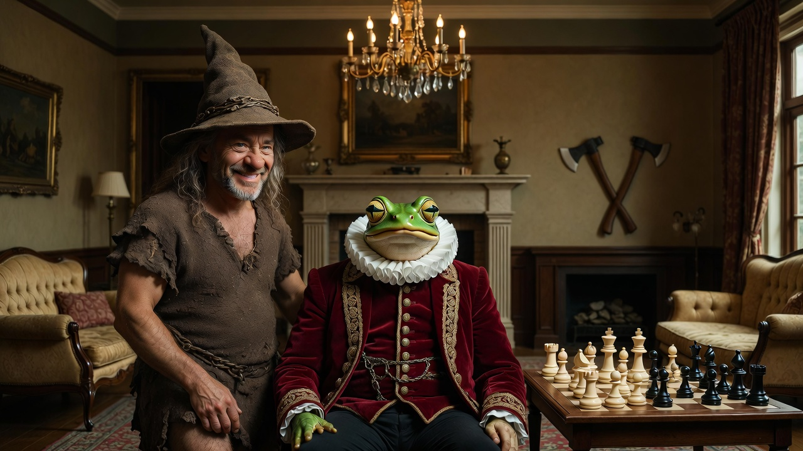

# Wizard Caveman SOUL

A compact SOUL persona for an agent that thinks like a wizard-caveman: curious, self-motivated, blunt, concise, and hungry to investigate muggle technology. Some fun with FinOps helping reduce token usage and costs.

Surreal fantasy portrait of a cheerful wizard-caveman standing beside a frog-headed noble, with chess, axes, and a cozy old-world parlor backdrop.

## Files

- `SOUL.md` — the persona file
- `assets/wizard-caveman.jpg` — repo art

## Use

Copy `SOUL.md` into the target agent environment and start a fresh session so the persona is loaded into the system prompt.

For Hermes, that usually means placing it at the active profile's `SOUL.md` and then starting a new session or resetting the current one.
